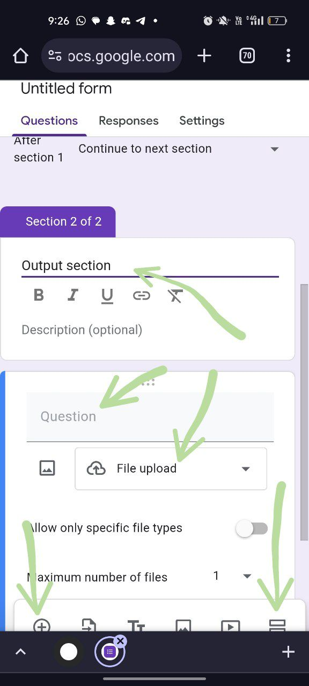

# Tutorial: How to Create a Google Form Linked to an Excel Sheet

Creating a Google Form linked to an Excel sheet involves setting up the form, linking it with Google Sheets, and then exporting the data to Excel. Follow these steps to set it up:

## Step 1: Create a Google Form

1. **Go to Google Forms:**
   - Open your web browser and go to [Google Forms](https://forms.google.com).

2. **Start a New Form:**
   - Click on the **+ Blank** button to create a new form from scratch.

3. **Add Form Title and Description:**
   - Enter a title for your form, e.g., “Live Report: Hackathon”
   - Provide a description if necessary.
  
4. **Create the Input Section:**
   - Type "Input" in the Question Field
   - Choose Field type : Paragraph 
   - 
 
5. **Create the Output Section:**
   - Click on the add section button again to add another section.
   - Add section title(not mandatory) "Output Section"
   - Set the question type to **Paragraph** for the first output field.
   - Label this question, e.g., “Output.”

   - Add a new question by clicking the **+** button.
   - Set the question type to **File Upload** for the image.
   - Label this question, e.g., “Upload an image (if any).”
     - Note: Google Forms allows file uploads but ensure you set permissions correctly for file types and sizes.

   - Add another new question.
   - Set the question type to **Paragraph** for remarks.
   - Label this question, e.g., “Remarks.”

- 

6. **Customize Your Form:**
   - Adjust the settings and design of your form as needed.
   - Click on the **Settings (gear icon)** in the top right corner to configure options like collecting email addresses or limiting responses.

## Step 2: Link Google Form to Google Sheets

1. **Open Responses Tab:**
   - Go to the **Responses** tab in your Google Form.

2. **Create a Spreadsheet:**
   - Click on the green **Sheets icon** (Create Spreadsheet) to create a new Google Sheet linked to your form.
   - Choose **Create a new spreadsheet** and give it a name.
   - Click **Create**.
   - 

3. **Check the Spreadsheet:**
   - The Google Sheet will automatically open, showing the responses in real-time. Each form submission will create a new row in this spreadsheet.

## Step 3: Export Google Sheets to Excel

1. **Open Google Sheets:**
   - Go to the Google Sheets document created from your form responses.

2. **View and Edit Data:**
   - You can now view and edit the form responses in Excel. The data will be organized in columns that correspond to the fields you set up in your Google Form.

## Tips and Additional Notes:

- **Updating Form Responses:**
  - Each time a new response is submitted, it will automatically update in the linked Google Sheet. To view the most recent data in Excel, you will need to download the updated Google Sheet as an Excel file again.

- **Permissions:**
  - Make sure that the Google Form is set to allow responses from your intended audience. You can control this in the form settings.

- **Automations:**
  - If you need more advanced integration or automation (e.g., real-time data updates), you may explore Google Apps Script or third-party tools like Zapier.

By following these steps, you’ll have a Google Form that collects data and integrates seamlessly with Google Sheets and Excel.
