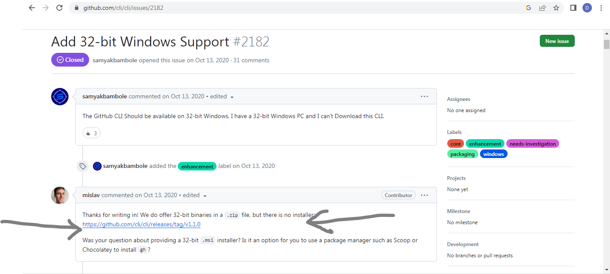

# Using GitHub CLI on x86/32-bit Windows

It is recommended that you first create your SSH key using the Git Bash guide. For instructions on how to do this, refer to the guide [here](https://docs.google.com/document/d/1DNwlGuI6MPxrOf48VGRHMZoxaiAJ3oghnN1wPOAx4nE/edit?usp=drivesdk).

## Installation

You can skip to [step 3](#step-3-access-the-download-link) if you just want to see the download page and download.

### Step 1: Search for GitHub CLI Availability

Start by searching for "Is GitHub CLI available on Windows 7 32-bit" in your preferred search engine. Click on the first link that appears in the search results.


### Step 2: Access the Download Link

On the resulting webpage, locate and click on the link shown for downloading the GitHub CLI for Windows.



### Step 3: Download the GitHub CLI

Scroll down on the download page and find the file named `gh_1.1.0_windows_386.zip`. Download this file to your computer.


### Step 4: Extract the Downloaded File

Locate the downloaded `gh_1.1.0_windows_386.zip` file on your computer and extract it. You can use a tool like WinRAR or the built-in Windows zip extractor.


### Step 5: Locate the Executable

After extraction, you will see a `bin` folder created with an executable file named `gh` inside it. You can run this executable directly, but it will only prompt you to open the Command Prompt and run the `gh` command.


### Step 6: Verify Installation

To verify that GitHub CLI is correctly installed, open the Command Prompt. Press `Windows + R`, type `cmd`, and hit Enter. In the Command Prompt window, type `gh` and press Enter. 


To check the installed version, type `gh --version` and press Enter.


## Usage

### Step 1: Authorize GitHub CLI

To start using GitHub CLI, you need to authorize it with your GitHub account. Type the following command in the Command Prompt:

```cmd
gh auth login
```


### Step 2: Choose Authentication Method

When prompted, choose "GitHub" among the options: GitHub or GitHub Enterprise.


now choose login with web browser from the option next.


### Step 3: Copy the One-Time Code

A one-time code will be provided. Copy this code and press Enter in the Command Prompt.


### Step 4: Authenticate on GitHub

Sign in if not already done like this: 

Paste the code into the GitHub authentication page that opens and click "Authenticate."

Click continue.

### Step 5: Grant Access

You will be asked to grant access to GitHub CLI. Confirm and grant access.


### Step 6: Complete Setup

Once the authorization is complete, you are ready to use GitHub CLI for various tasks directly from the Command Prompt.


## Using GitHub CLI

With GitHub CLI authorized, you can perform actions similar to those available on the GitHub website directly from the Command Prompt. For example, to create a new repository, use the following command:

```bash
gh repo create new-repository-name --public --description "This is a tutorial repo"
```

Replace `"This is a tutorial repo"` with a meaningful description of your repository.


Enter yes.

#### And voila you've created your first repo from CUI!!
