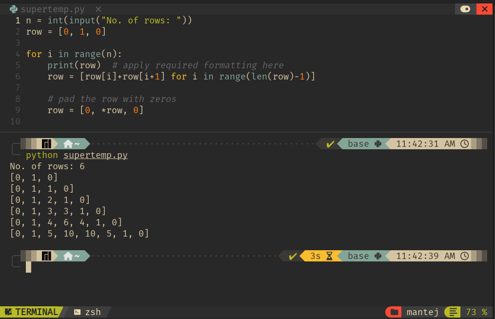

# The Concept of Layering in Python

It took nature a hundred million years to go from water to land,  
but only a hundred to go from here to Mars.

Every civilization builds on top of the knowledge and resources acquired by its ancestors, compounding their quality of life.  

Programming languages have evolved no differently. We went from magnetic tapes to binary, from assembly to C, and now we stand at Python.

I call this **layering** — and once you see it, you will find it everywhere.

---

## Illustration

Let's quickly see *layering* in action. Read this question:

> An Armstrong Number is a number that is equal to the sum of its own digits each raised to the power of the number of digits.  
> Example:  
> 153 = 1 ^ 3 + 5 ^ 3 + 3 ^ 3 = 1 + 125 + 27 = 153 # Armstrong Number  
> 1634 = 1 ^ 4 + 6 ^ 4 + 3 ^ 4 + 4 ^ 4 = 1634 # Armstrong Number  

An assembly code for this would surely knock our brains out, so let’s see how a C or C++ programmer may approach this question.

```python
import math

n = int(input("num: "))
copy = n 
sum = 0

len = int(math.log10(n)) + 1

while n != 0:
    sum += (n % 10) ** len
    n //= 10

print("Armstrong" if copy == sum else "Not Armstrong")
```

While this solution uses Python, it still thinks like a C++ developer—extracting digits manually. Now, let’s see how a more Pythonic approach simplifies it.

```python
num = input("num: ")  # A string input

len = len(num)
sum = sum(int(digit) ** len for digit in num)

print("Not Armstrong" if sum != int(num) else "Armstrong")
```

A Python developer thinks in terms of **iterables**—sequences like lists, tuples, strings, and ranges that can be traversed in a structured way.  

Basically, think about how data structures can be put to use.  

I personally like to think of them as tools, as a result of layering. **Every language has a set of its own tools waiting for you to discover them.** *Layering allows us to think in higher terms.* For example, the C++ developer thinks in terms of individual digits, removing them using `//` and more; so number-oriented, far away from the bigger picture.This is also one of the reasons why machine learning is done in Python despite C++ or C being faster(especially on GPU).

As you learn a language, observe the patterns in it. Your tool inventory will grow in size. Right now, it may look like this:

1. Iterables (`list`, `tuple`, `str`, `range`)  
2. Collections (`dict`, `set`, `map`)  
3. Basic weapons (`def`, `for`, `while`, `if`, `in`, `not in`, conditional expressions, `sorted()`, and more)

---

## Solidifying the Iterable Concept

Now, let’s take a problem often solved using nested loops and see how an iterable-based approach changes our thinking.

> Print Pascal's Triangle  
>     1  
>    1 1  
>   1 2 1  
>  1 3 3 1  
> Upto `n` rows...

Given your previous experience in C, C++, or maybe Java, you might think of the solution in the form of a grid, figuring out a rule to print where `i` and `j` values match or meet a requirement. Sure, you may find success in that.

> Some may say it’s `11^0`, then `11^1`, then `11^2`, then `11^3`, and so on up to `n`.  
> However, this solution is only valid until there are single-digit numbers in the triangle. The rule fails at `1 5 10 10 5 1`.

### Can You Now Think in Terms of Iterables?

**Hint 1:** Stop thinking of nested loops (grid).  
**Hint 2:** Think of each row as one list (iterable).

**Answer:**

```python
n = int(input("No. of rows: "))
row = [0, 1, 0]

for i in range(n):
    print(row)  # print(" ".join(str(x) for x in row)[1:-1]) 
    row = [row[i] + row[i + 1] for i in range(len(row) - 1)]

    # Pad the row with zeros
    row = [0, *row, 0]
```

This is the output of this code:  


#### Did You Get It?!

I think by now, it is pretty evident what is meant by "layering" and "tools."  
I suggest you increase the size of your arsenal (weapons), too. For instance, here you must have seen the unpacking operator (`*`) used to open and spread out an iterable into another so that it’s not nested.

Find and learn how to use more weapons, like the walrus operator (`:=`) and others.  

As you find more *tools* like iterables and collections, you will need more weapons to implement them.

---

## Quick Brainer

> Count the number of vowels in a string and print it.

Try to solve this by yourself and then see the solution below:  
**DO NOT LOOK BELOW!**

```python
sentence = input("Enter a sentence: ")

def count_vowels(sentence):
    return sum([sentence.count(vowel) for vowel in "aeiouAEIOU"])
```

> Exercise: Find the redundancy in the above code for counting vowels in a string.


> Bonus: Here is the same code in a simpler way:

```python
sentence = input("Enter a sentence: ")

def count_vowels(sentence):
    return sum(1 for ch in sentence if ch in "aeiouAEIOU")
```

## Conclusion

Ponder. 
Read existing code written in python from your friends, in a competition, from documentation or anywhere else. 

Once you have some basic knowledge make some projects(trust me its the best way to learn).

Checkout this [video](https://youtu.be/Yh5gcLG6C3Q) to see what can you make with python

---
