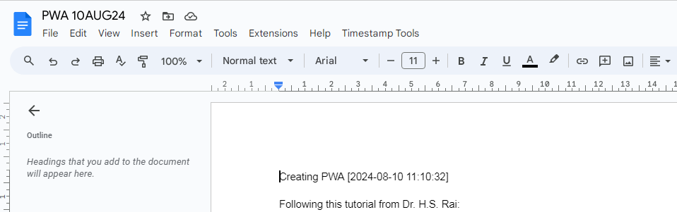

# Insert Timestamp Quickly In Google Docx for LIVE REPORTING 


## Setup in 3 minutes!
To automatically insert timestamps in Google Docs, you can use ***Google Apps Script*** to create a custom function. Here’s a step-by-step guide to set it up:

### 1. Create a Google Apps Script
<u>Open Your Google Doc:</u>
Open the Google Doc where you want to insert timestamps.

<u>Access Apps Script:</u>
Go to Extensions > Apps Script.


<u>Create a New Script:</u>
Delete any code in the script editor and paste the following javascript code:

> ```javascript
> // Function to insert a timestamp
> function insertTimestamp() {
>   var doc = DocumentApp.getActiveDocument();
>   var body = doc.getBody();
>   var date = new Date();
>   var timestamp = Utilities.formatDate(date, Session.getScriptTimeZone(), 'yyyy-MM-dd HH:mm:ss');
> 
>   // Insert the timestamp at the cursor position
>   var cursor = doc.getCursor();
>   if (cursor) {
>     cursor.insertText(timestamp);
>   } else {
>     // If no cursor, append the timestamp at the end of the document
>     body.appendParagraph(timestamp);
>   }
> }
> 
> // Function to create a custom menu
> function onOpen() {
>   var ui = DocumentApp.getUi();
>   ui.createMenu('Timestamp Tools')
>     .addItem('Insert Timestamp', 'insertTimestamp')
>     .addToUi();
> }
> ```


### 2. Save the Script

Click the floppy disk icon or go to File > Save. Name your project (e.g., "Timestamp Inserter").
Authorize the Script:

### 3. Authorize the Script
The first time you run the script or add it to your Google Doc, you'll need to authorize it. Click on Run (the play icon) in the Apps Script editor and follow the authorization prompts.
Refresh Your Google Doc:

### 4. Enjoy!
Reload your Google Doc to see the new menu item.
Use the Custom Menu:

Go to Timestamp Tools in the menu bar and select Insert Timestamp to insert the current timestamp.
It should look like this:




# FAQ

<details>
  
  <summary>
    <h2>1. How to assign a shortcut key to insert timestamps</h2>
  </summary>
  
***Shortcuts Are Not Supported in Google Apps Scripts***


Directly assigning keyboard shortcuts like `Alt+Shift+T` to Google Apps Script functions in Google Docs **is not natively supported**. Google Docs and Google Apps Script do not have built-in functionality for creating keyboard shortcuts for custom scripts.

However, you can use:

#### Browser Extensions for Keyboard Shortcuts
You can use browser extensions to create custom keyboard shortcuts that trigger specific actions, including running scripts or automating tasks in your browser. For example:

Google Chrome: Use extensions like Shortkeys to assign keyboard shortcuts to various actions.

Steps:

1. Install the extension.
2. Configure a new shortcut in the extension settings.
3. Set the action to open a specific URL or trigger an action in your document.

Firefox: Use Shortkeys or a similar extension.
</details>


<details>
  <summary>
    <h2>2. How to use it?</h2>
  </summary>

  **Simply click on the newly created `Timestamp Tools` tab** in the above home panel as shown in the above image<be>
  and choose `Insert Timestamp`

  
</details>
